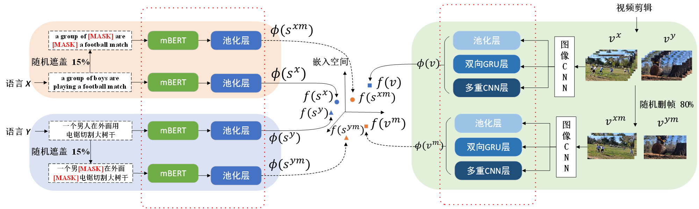

# 多语言文本-视频跨模态检索的新基线模型

"多语言文本-视频跨模态检索的新基线模型"论文源代码



## 内容列表

- [环境](#环境)
- [数据准备](#数据准备)
- [MLCMR on VATEX](#MLCMR-on-VATEX)
  - [Model Training and Evaluation](#model-training-and-evaluation)
  - [Evaluation using Provided Checkpoints](#Evaluation-using-Provided-Checkpoints)
  - [Expected Performance](#Expected-Performance)
- [MLCMR on MSRVTT](#NRCCR-on-MSRVTT10K-CN)
  - [Model Training and Evaluation](#model-training-and-evaluation-1)
  - [Evaluation using Provided Checkpoints](#Evaluation-using-Provided-Checkpoints-1)
  - [Expected Performance](#Expected-Performance-1)
- [Reference](#Reference)

## 环境

- CUDA 10.1
- Python 3.8
- PyTorch 1.5.1

我们使用Anaconda设置了一个支持PyTorch的深度学习工作区，请运行以下脚本以安装所需的程序包。

```shell
conda create --name mlcmr python=3.8
conda activate mlcmr
git clone https://github.com/LiJiaBei-7/nrccr.git
cd mlcmr
pip install -r requirements.txt
conda deactivate
```

## 数据准备

我们使用两种公开数据集: VATEX, MSR-VTT. 预训练提取的特征请放置在  `$HOME/VisualSearch/`.

For Multi-30K, we have provided translation version (from Google Translate) of Task1 and Task2, respectively.  [Task1: Applied to translation tasks. Task2: Applied to captioning tasks.].

In addition, we also provide MSCOCO dataset here, and corresponding performance below.  The validation and test set on Japanese from [STAIR Captions](https://stair-lab-cit.github.io/STAIR-captions-web/), and that on Chinese from [COCO-CN](https://github.com/li-xirong/coco-cn).

Training set:

	source(en) + translation(en2xx) + back-translation(en2xx2en)

Validation set and test set:

	target(xx) + translation(xx2en)

| Dataset    | feature                                                      | caption                                                      |
| ---------- | ------------------------------------------------------------ | ------------------------------------------------------------ |
| VATEX      | [vatex-i3d.tar.gz, pwd:p3p0](https://pan.baidu.com/s/1lg23K93lVwgdYs5qnTuMFg?pwd=p3p0) | [vatex_caption, pwd:oy27](https://www.aliyundrive.com/s/xDrzCDNEHWP) |
| MSR-VTT-CN | [msrvtt10k-resnext101_resnet152.tar.gz, pwd:p3p0](https://pan.baidu.com/s/1lg23K93lVwgdYs5qnTuMFg?pwd=p3p0) | [cn_caption, pwd:oy27](https://www.aliyundrive.com/s/3sBNJqfTxcp) |
| Multi-30K  | [multi30k-resnet152.tar.gz, pwd:5khe](https://pan.baidu.com/s/1AzTN6rFyabirACVkVEVKCQ) | [multi30k_caption, pwd:oy27](https://www.aliyundrive.com/s/zGEbQAvqHGy) |
| MSCOCO     |                                                              | [mscoco_caption, pwd:13dc](https://www.aliyundrive.com/s/PxToUYryguz) |


```shell
ROOTPATH=$HOME/VisualSearch
mkdir -p $ROOTPATH && cd $ROOTPATH

请组织这些文件成下面的形式:
# 下载VATEX数据[英语, 中文]
VisualSearch/VATEX/
	FeatureData/
		i3d_kinetics/
			feature.bin
			id.txt
			shape.txt
			video2frames.txt
	TextData/
		xx.txt

# 下载MSR-VTT数据[英语, 中文]
VisualSearch/msrvtt/
	FeatureData/
		resnext101-resnet152/
			feature.bin
			id.txt
			shape.txt
			video2frames.txt
	TextData/
		xx.txt

```

## MLCMR on VATEX

### Model Training and Evaluation

Run the following script to train and evaluate `NRCCR` network. Specifically, it will train `NRCCR` network and select a checkpoint that performs best on the validation set as the final model. Notice that we only save the best-performing checkpoint on the validation set to save disk space.

```shell
ROOTPATH=$HOME/VisualSearch

conda activate nrccr_env

# To train the model on the MSR-VTT, which the feature is resnext-101_resnet152-13k 
# Template:
./do_all_vatex.sh $ROOTPATH <gpu-id>

# Example:
# Train NRCCR 
./do_all_vatex.sh $ROOTPATH 0
```

`<gpu-id>` is the index of the GPU where we train on.

### Evaluation using Provided Checkpoints

Download trained checkpoint on VATEX from Baidu pan ([url](https://pan.baidu.com/s/1QPPBZq_fN8D4tnf_dhfQKA),  pwd:ise6) and run the following script to evaluate it.

```shell
ROOTPATH=$HOME/VisualSearch/

tar zxf $ROOTPATH/<best_model>.pth.tar -C $ROOTPATH

./do_test_vatex.sh $ROOTPATH $MODELDIR <gpu-id>
# $MODELDIR is the path of checkpoints, $ROOTPATH/.../runs_0
```

### Expected Performance

| Type  | Text-to-Video Retrieval | Video-to-Text Retrieval | SumR |
| ----- | ----------------------- | ----------------------- | ---- |
| R@1   | R@5                     | R@10                    | MedR |
| en2cn | 30.8                    | 64.4                    | 74.6 |


## MLCMR on MSR-VTT

### Model Training and Evaluation

Run the following script to train and evaluate `NRCCR` network on MSR-VTT-CN.

```shell
ROOTPATH=$HOME/VisualSearch

conda activate nrccr_env

# To train the model on the VATEX
./do_all_msrvttcn.sh $ROOTPATH <gpu-id>
```

### Evaluation using Provided Checkpoints

Download trained checkpoint on MSR-VTT-CN from Baidu pan ([url](https://pan.baidu.com/s/1QPPBZq_fN8D4tnf_dhfQKA),  pwd:ise6) and run the following script to evaluate it.

```shell
ROOTPATH=$HOME/VisualSearch/

tar zxf $ROOTPATH/<best_model>.pth.tar -C $ROOTPATH

./do_test_msrvttcn.sh $ROOTPATH $MODELDIR <gpu-id>
# $MODELDIR is the path of checkpoints, $ROOTPATH/.../runs_0
```

### Expected Performance

| Type  | Text-to-Video Retrieval | Video-to-Text Retrieval | SumR |
| ----- | ----------------------- | ----------------------- | ---- |
| R@1   | R@5                     | R@10                    | MedR |
| en2cn | 28.9                    | 56.3                    | 67.3 |


## Reference

If you find the package useful, please consider citing our paper:

```
@inproceedings{wang2022cross,
  title={Cross-Lingual Cross-Modal Retrieval with Noise-Robust Learning},
  author={Yabing Wang and Jianfeng Dong and Tianxiang Liang and Minsong Zhang and Rui Cai and Xun Wang},
  journal={In Proceedings of the 30th ACM international conference on Multimedia},
  year={2022}
}
```